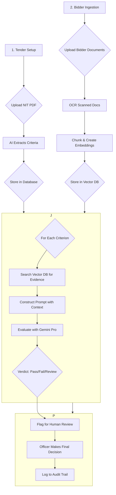

**An AI-powered procurement evaluation platform that automates bidder eligibility assessment against government tender criteria with complete auditability and transparency.**

---


_A placeholder image - consider adding a GIF of the app in action!_

## 🎯 The Problem

Manually evaluating hundreds of bidders against complex, multi-document tender requirements in Indian government procurement is:

- **Time-Consuming:** Officers spend weeks sifting through thousands of pages.
- **Error-Prone:** It's easy to miss critical details in dense documents.
- **Lacks Transparency:** The decision-making process is often opaque and difficult to audit.

This leads to delays, potential for errors, and a lack of clear, evidence-based decision-making.

## ✨ The Solution

The **CRPF Tender Intelligence Console** is a full-stack web application that transforms the tender evaluation process. It ingests tender documents and bidder submissions, uses AI to extract and evaluate criteria, and provides a clear, auditable, and efficient workspace for procurement officers.

Our platform:

- **Automatically extracts** eligibility criteria from tender PDFs.
- **Evaluates bidders** across both digital and scanned documents using a powerful AI engine.
- **Provides evidence-based verdicts** with step-by-step reasoning for full transparency.
- **Flags ambiguous cases** for human review, ensuring accuracy and compliance.
- **Maintains a complete audit trail** of every action for unparalleled accountability.

## 🚀 Key Features

- **🤖 Intelligent Criteria Extraction:** Parses tender PDFs to automatically identify and structure all eligibility criteria (Technical, Financial, Compliance) using Google Gemini Pro.
- **📄 Multi-Format Document Ingestion:** Handles digital PDFs, scanned images (with Vision OCR), text files, and DOCX files.
- **🧠 Vector-Based Semantic Search:** Uses ChromaDB and Google's embeddings to instantly find relevant evidence within bidder documents (RAG pattern).
- **⚙️ AI-Powered Evaluation Engine:** A robust LangGraph workflow evaluates each criterion, providing a `pass`, `fail`, or `review` verdict with detailed reasoning.
- **📊 Interactive Evaluation Matrix:** A visual grid that displays the evaluation status of all bidders against all criteria in real-time.
- **🧑‍⚖️ Human-in-the-Loop Review Queue:** Ambiguous or failed mandatory criteria are automatically flagged for a procurement officer's final decision.
- **📂 Bidder Dossiers & Risk Scoring:** Compiles all of a bidder's documents and evaluation results into a single dossier, complete with a risk score.
- **🔐 Complete Audit Trail:** Every action—from document upload to final decision—is logged with timestamps and user details for full auditability.
- **🇮🇳 India-Specific Parsing:** Includes custom logic to parse Indian financial formats (Crore, Lakh), GST numbers, and other local entities.

## 🔄 How It Works

The system follows a sophisticated workflow to ensure accurate and auditable evaluations.



## 🛠️ Tech Stack

| Category            | Technology                                                        |
| ------------------- | ----------------------------------------------------------------- |
| **Backend**         | `FastAPI`, `Uvicorn`, `Python 3.11`                               |
| **AI / LLM**        | `Google Generative AI (Gemini Pro)`, `LangChain`, `LangGraph`     |
| **Vector Database** | `ChromaDB` (with Google Embeddings)                               |
| **Data & Parsing**  | `SQLite`, `PyPDF`, `PDF2Image`, `Pydantic`                        |
| **Frontend**        | `React 19`, `Vite`, `React Router`                                |
| **Styling & UI**    | `TailwindCSS`, `Framer Motion`, `Lucide React`, `React Hot Toast` |

## 🚀 Getting Started

To run this application, you need to start both the **Backend** (Python/FastAPI) and the **Frontend** (React/Vite) in two separate terminals.

### Prerequisites

- Python 3.10+
- Node.js 18+ and npm
- An optional `GOOGLE_API_KEY` for full AI features (place it in a `.env` file in the root directory).

### Step 1: Start the Backend (Terminal 1)

```bash
# 1. Navigate to the project root
cd AI-for-Bharat-Prototype

# 2. Create and activate a Python virtual environment
python3 -m venv .venv
source .venv/bin/activate
# On Windows: .\.venv\Scripts\activate

# 3. Install Python dependencies
pip install -r requirements.txt

# 4. Run the backend server
uvicorn main:app --host 127.0.0.1 --port 8000 --reload
```

The backend will be running at `http://127.0.0.1:8000`.

### Step 2: Start the Frontend (Terminal 2)

```bash
# 1. Navigate to the Frontend directory
cd Frontend

# 2. Install Node.js dependencies
npm install

# 3. Run the frontend development server
npm run dev
```

The frontend will be running at `http://localhost:5173`.

### Step 3: Open The App!

🚀 Your **CRPF Tender Intelligence Console** is now live at **[http://localhost:5173](http://localhost:5173)**.

## 📂 Project Structure

```
├── Frontend/         # React Vite Frontend
│   ├── src/
│   │   ├── pages/    # Main pages (Dashboard, etc.)
│   │   ├── components/ # Reusable React components
│   │   └── api/      # API client for backend communication
├── app/              # Core FastAPI application logic
│   ├── analysis.py   # Evaluation logic
│   └── db.py         # Database models and interactions
├── src/              # Python source for AI engine
│   ├── engine/       # Parsing and Vector Store logic
│   └── graph/        # LangGraph evaluation workflow
├── data/             # Data files (tenders, bidders, DBs)
├── main.py           # FastAPI app entry point
├── requirements.txt  # Python dependencies
└── README.md         # You are here!
```

## 🛣️ Future Roadmap

- [ ] **Real-time Collaboration:** Allow multiple officers to review a tender simultaneously.
- [ ] **Advanced Analytics:** Provide dashboards with insights into bidder performance and common failure points.
- [ ] **Deeper Financial Analysis:** Integrate more complex financial health checks (e.g., balance sheet analysis).
- [ ] **Multi-Language Support:** Extend parsing capabilities to handle tenders in Hindi and other regional languages.

## 🤝 Contributing

This project was built for the **AI-for-Bharat** hackathon. We welcome contributions and ideas to make government procurement more efficient and transparent. Please feel free to fork the repo, open an issue, or submit a pull request.

---

**Built with ❤️ for a more transparent and efficient Bharat.**

_(Note: You can still view the printable reports from the backend directly if needed)._

## Seeded demo workspace

On first startup, the app auto-loads the bundled CRPF mock tender and three bidder packs:

- `AlphaCorp Construction Solutions`
- `BetaTech Infrastructure Ltd.`
- `Gamma Infra Projects`

This gives you an immediate dashboard with:

- extracted tender criteria
- per-bidder evaluation matrix
- manual review queue
- audit trail
- exportable report

## Main files

```text
main.py                 FastAPI app and routes
app/db.py               SQLite schema and connection helpers
app/analysis.py         document parsing, criteria extraction, and evaluation logic
app/repository.py       persistence, reporting, and workflow orchestration
app/seed.py             demo workspace bootstrap
templates/index.html    main application shell
templates/report.html   printable report view
static/styles.css       product UI styling
static/app.js           frontend rendering and interactions
```

## Product features implemented

- Tender workspace selector
- Tender creation modal
- Bidder upload modal
- Criteria editor
- Evaluation matrix
- Bidder dossier panels
- Manual review resolution
- Audit event stream
- CSV export
- JSON export
- Printable report page

## Notes

- The legacy `src/` prototype code is still in the repo, but the live product now runs through `main.py` and the `app/` package.
- Scanned image handling is designed to never silently disqualify a bidder. If OCR is unavailable or low confidence, the system routes that criterion to manual review.
